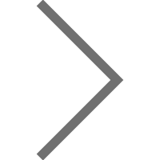

# my-swiper

> 记录一下做轮播图插件的过程...

###### 某些图片不显示可查看这个：[掘金博客](https://juejin.im/post/5d7713926fb9a06af629d7b3)

效果图

##### 普通轮播图


##### 卡片式轮播图


##### 堆叠式轮播图


## 普通轮播图

> **功能：** 
```
* 可控制是否自动轮播
* 左右箭头切换上一张，下一张，节流处理
* 鼠标放到箭头上，图片停止自动轮播，鼠标移开接着继续播放
* 点击小圆点可跳转到对应顺序的图片
* 移动端可左滑、右滑切换
```

[普通轮播图-演示](https://orangleli.github.io/%E8%BD%AE%E6%92%AD%E5%9B%BE/%E6%99%AE%E9%80%9A%E8%BD%AE%E6%92%AD/%E6%99%AE%E9%80%9A%E8%BD%AE%E6%92%AD.html)

[普通轮播图-源码](https://github.com/orangleLi/my-swiper)

### 思路：


如上图所示，假设有三张图片进行轮播，绿色区域是显示区域，其它部分都是隐藏的

*  页面渲染时,会多选择两张图片，图中数字1，2，3分别表示第几张图片，A,B,C,D分别代表不同时间的图片列表div的状态
*  A矩形框为页面启动时的效果，展示第一张图片
* B为下一张的效果图，展示第二张图片
* 一直下一张直到展示第一张时，如C中所示，这时已经是当前图片列表的最后一张了，所以要将C的状态变为D的状态，展示的还是第一张图片，相当于只是悄悄把图片列表div的left值变化了，展示的图片并没有变还是第一张图片
* 上一张也是相同的思路


### 页面布局


* class="swiper-list" 这个div为视口div,大小和图片的大小相同，其余部分隐藏
* class="swiper-main" 这个div为图片列表div，通过不断变化left值来切换上一张图片和下一张图片
* 切换下一张图片时，图片列表div的left值在原有的基础上减去一个图片的宽度
* 切换上一张图片时，图片列表div的left值在原有的基础上加去一个图片的宽度

### 源码

#### 上一张，下一张核心方法
nowIndex 用来标记当前展示的是第几张图片，初始值为0
```
// 上一张
prevSlider(aniTIme) {
	let that = this;
	if (this.imgArr.length===1) return;
	this.mainDom.style.transition = `left ${aniTIme / 1000}s`
	this.mainDom.style.left = `${parseInt(this.mainDom.style.left) + this.moveWidth}px`; // 图片列表div的left值变化
	if (this.nowIndex === 0) {
		that.nowIndex = (that.imgArr.length-1);
		that.setActiveSpot();
		setTimeout(function() {					
			that.mainDom.style.transitionProperty = 'none'; // 悄悄换left值时，要设置这个属性，不然会播放动画
			that.mainDom.style.left = `${-that.imgArr.length * that.moveWidth}px`;
		}, aniTIme) // 当前展示第一张，上一张再没有了，悄悄把图片列表页left值变化，展示的图片还是第一张图片
	} else {
		this.nowIndex--;
		this.setActiveSpot();
	}
},
// 下一张
nextSlider(aniTIme) {
	let that = this;
	if (this.imgArr.length===1) return;
	this.nowIndex++;
	this.mainDom.style.transition = `left ${aniTIme / 1000}s`
	this.mainDom.style.left = `${parseInt(this.mainDom.style.left) - this.moveWidth}px`;
	if (this.nowIndex === (this.imgArr.length)) {
		that.nowIndex = 0;
		that.setActiveSpot();
		setTimeout(function() {
			that.mainDom.style.transitionProperty = 'none';
			that.mainDom.style.left = `${-that.moveWidth}px`;
		}, aniTIme) // 当前展示最后一张，下一张再没有了，悄悄把图片列表div的left值变化，展示的图片还是最后一张图片
	} else {
		this.setActiveSpot();
	}
},
// 设置原点样式
setActiveSpot: function() {
	for (let i = 0; i < this.swiperSpotDom.childElementCount; i++) {				
		if (i === Math.abs(this.nowIndex)) {
			document.getElementsByClassName('spot-item')[i].style.backgroundColor = '#ff5c1f'
		} else {
			document.getElementsByClassName('spot-item')[i].style.backgroundColor = '#ccc'
		}
	}
},                              
```


#### 下一张按钮事件绑定，节流处理

```
eventBind() {
    ...
    
    // 下一张按钮事件绑定
    this.rightBtn.addEventListener('mouseover', function() {
    	clearInterval(that.timer);
    })
    this.rightBtn.addEventListener('mouseout', function() {
    	that.timer = setInterval(that.nextSlider.bind(that, that.aniTIme), that.intervalTime);
    })
    this.rightBtn.addEventListener('click', function() {
    	that.throttle(that.nextSlider, 300, 300);
    })
    
    ...
}

    
// 节流：时间戳版
throttle(handle, delay, val) {
    var now = Date.now();
    if (now - this.prev >= delay) {
        handle.call(this, val);
        this.prev = Date.now();
    }
},
```
节流：使事件均匀间隔时间触发

这里的节流和其他的节流写的有点不一样，可以根据自己的来


### 小圆点点击事件绑定


```
eventBind() {
    ...
    
    // 小圆点事件绑定
	this.swiperSpotDom.addEventListener('mouseover', function() {
		clearInterval(that.timer);
	})
	this.swiperSpotDom.addEventListener('mouseout', function() {
		that.timer = setInterval(that.nextSlider.bind(that, that.aniTIme), that.intervalTime);
	})
	this.swiperSpotDom.addEventListener('click', function(e) {
		e = e || window.event; //这一行及下一行是为兼容IE8及以下版本
	　　var target = e.target || e.srcElement;
	　　if (target.tagName.toLowerCase() === "li") {
　　　　    var ret = this.querySelectorAll("li");
　　　　    let index = Array.prototype.indexOf.call(ret, target);
			that.nowIndex = index;
			that.setActiveSpot();
			that.mainDom.style.transition = `left .8s`
			that.mainDom.style.left = `${-(that.nowIndex+1) * that.moveWidth}px`;
	　　}
	})
    
    ...
}
```
判断点击的是哪一个li, 并把下标值赋给nowIndex，图片列表div（mainDom）的left值变化，更新原点的样式


### 移动端左右滑动事件


```
eventBind() {
    ...
    
    this.mainDom.addEventListener('touchstart', function(e) {
		clearInterval(that.timer);
		that.startX = e.changedTouches[0].clientX;
		that.startY = e.changedTouches[0].clientY;
	})
	this.mainDom.addEventListener('touchmove', function(e) {
		clearInterval(that.timer);
		that.endX = e.changedTouches[0].clientX;
		that.endY = e.changedTouches[0].clientY;
	})
	this.mainDom.addEventListener('touchend', function(e) {
		if (!that.mainDom.style.transition) {
			that.mainDom.style.transition = `left ${that.aniTIme / 1000}s`
		}
		let angle = that.angle({ X: that.startX, Y: that.startY }, { X: that.endX, Y: that.endY });
		if (Math.abs(angle) > 30) return;
	    if (that.endX > that.startX){ // 右滑
	    	that.prevSlider();
	    } else { // 左滑
	    	that.nextSlider();
	    }
		that.timer = setInterval(that.nextSlider.bind(that, that.aniTIme), that.intervalTime);
		
	})
    
    ...
}，

/**
* 计算滑动角度
* @param {Object} start 起点坐标
* @param {Object} end 终点坐标
*/
angle: function (start, end) {
    var _X = end.X - start.X,
      _Y = end.Y - start.Y
    //返回角度 /Math.atan()返回数字的反正切值
    return 360 * Math.atan(_Y / _X) / (2 * Math.PI);
}
```

左滑调用nextSlider()，右滑调用prevSlider()

### 使用：
引入slider.js


```
	<div class="swiper-list"></div>
```
```
let imgArr = [
	{
		url: '#',
		imgPath: '../i.jpg'
	},
	{
		url: '#',
		imgPath: '../o.jpg'
	},
	{
		url: '#',
		imgPath: '../q.jpeg'
	},
	{
		url: '#',
		imgPath: '../w.jpg'
	},
	{
		url: '#',
		imgPath: '../z.png'
	}
];
// let imgArr = ['i.jpg', 'o.jpg', 'q.jpeg'];
// let imgArr = ['i.jpg', 'o.jpg'];
// let imgArr = ['i.jpg'];
new Swiper({
	imgArr: imgArr, // 图片数组
	aniTIme: 1000, // 动画执行的时间
	intervalTime: 1000, // 图片停留的时间
	autoplay: true // 是否自动播放
}).init();
```
css

```
<style>
	ul{padding: 0; list-style: none;}
	.swiper-list{
		width: 640px;
		height: 360px;
		margin: 0 auto;
		position: relative;
		overflow: hidden;
	}
	.swiper-main {
		height: 100%;
		position: relative;
		overflow: hidden;
	}
	.swiper-item{
		height: 100%;
		display: inline;
		position: absolute;
	}
	img {
		width: 100%;
		height: 100%;
		display: block;
	}

	.swiper-spot{
		width: 100%;
		height: 15px;
		display: flex;
		justify-content: center;
		align-items: center;
		position: absolute;
		bottom: 10px;
	}
	.swiper-spot .spot-item{
		width: 15px;
		height: 15px;
		border-radius: 50%;
		background-color: #ccc;
		margin-left: 10px;
	}
	.swiper-spot .spot-item:nth-of-type(1) {
		margin-left: 0;
	}

	.leftBtn{
		position: absolute;
		left: 15px;
		top: 50%;
		transform: translateY(-50%);
		width: 30px;
		height: 30px;
	}
	.rightBtn{
		position: absolute;
		right: 15px;
		top: 50%;
		transform: translateY(-50%);
		width: 30px;
		height: 30px;
	}
</style>
```
## 卡片式轮播

> **功能：** 
```
* 可控制是否自动轮播
* 左右箭头切换上一张，下一张，节流处理
* 鼠标放到箭头上，图片停止自动轮播，鼠标移开接着继续播放
* 移动端可左滑、右滑切换
```

[卡片式轮播-演示](https://orangleli.github.io/%E8%BD%AE%E6%92%AD%E5%9B%BE/%E5%8D%A1%E7%89%87%E5%BC%8F%E8%BD%AE%E6%92%AD/%E5%8D%A1%E7%89%87%E5%BC%8F%E8%BD%AE%E6%92%AD.html)

[卡片式轮播-源码](https://github.com/orangleLi/my-swiper)


### 思路：

与普通轮播图思路相同，不过这个头和末尾分别加了两张图片用来过渡，也是图片移动到临界值时，图片列表div的left值改变，展示的是同一张图片，但是图片列表div的left值不同

### 代码

这里的nowIndex默认值为3， 由于头追加了两张图片，要使下标为3的元素是中间的图片，并且没有进行缩放，其余图片是缩小的

```
/**
* obj: 
* imgArr 图片数组
* imgWidth 图片宽度
* aniTime 动画切换时间
* intervalTime 停留的时间
* scale 图片缩放
* autoplay 是否自动播放
* gap 图片之间间隔
*/
function Swiper(obj) {
	this.imgArr = obj.imgArr || [];
	this.scale = obj.scale || 0.8; // 图片缩放值
	this.gap = obj.gap; // 图片未缩放状态下图片之间的间隔

	// 移动端
	if ((navigator.userAgent.match(/(phone|pad|pod|iPhone|iPod|ios|iPad|Android|Mobile|BlackBerry|IEMobile|MQQBrowser|JUC|Fennec|wOSBrowser|BrowserNG|WebOS|Symbian|Windows Phone)/i))) {
	   this.containerWidth = document.body.clientWidth; // 轮播图盒子宽度
	}else{
		// PC端
	   this.containerWidth = 600; // 轮播图盒子宽度
	}
	this.imgWidth = obj.imgWidth; // 图片宽度
	this.aniTime = obj.aniTime || 500;
	this.intervalTime = this.aniTime + obj.intervalTime || 2000;
	this.nowIndex = 3;
	this.imgDoms = document.getElementsByClassName('swiper-slide');
	this.mainDom = document.getElementsByClassName('swiper-main')[0];
	this.listDoms = document.getElementsByClassName('swiper-list')[0];
	this.activeDom = this.imgDoms[0];
	this.autoplay = obj.autoplay;

	this.listDoms.style.width = `${this.containerWidth}px`;

	this.timer; // 自动播放的定时器
	this.prev = Date.now();

	this.diffLen = (this.containerWidth - this.imgWidth - (this.gap * 2)) / 2;
  	this.clsSuffix = obj.clsSuffix; // 类名后缀
}
```
diffLen值：


```
prevSlider: function(aniTime) {
	if (this.imgArr.length ===2) {
		this.nowIndex = this.nowIndex ? 0 : 1;
		this.setScale()
	} else if (this.imgArr.length ===1) {
		return;
	} else {
		this.nowIndex--;
		this.mainDom.style.transition = `left ${aniTime/1000}s`
		this.mainDom.style.left = `${parseInt(this.mainDom.style.left)+(this.gap + this.imgWidth)}px`;
		if (this.nowIndex === 1) {
			this.setScale()
			setTimeout(function() {
				this.nowIndex = (this.imgArr.length+1);
				this.setScale()
				this.mainDom.style.transitionProperty = 'none';
				this.mainDom.style.left = `${-(parseInt(this.imgDoms[this.nowIndex].style.left) - this.diffLen - this.gap)}px`;
			}.bind(this), aniTime)
		} else {
			this.setScale()
		}
	}
},
nextSlider: function(aniTime) {
	if (this.imgArr.length ===2) {
		this.nowIndex = this.nowIndex ? 0 : 1;
		this.setScale()
	} else if (this.imgArr.length ===1) {
		return;
	} else {
		if (this.nowIndex >=2) {	
			this.mainDom.style.transition = `left ${aniTime/1000}s`
			this.mainDom.style.left = `${parseInt(this.mainDom.style.left)-(this.gap + this.imgWidth)}px`;
			// this.mainDom.style.left = `${this.gap + this.imgWidth}px`;
		}
		if (this.nowIndex === (this.imgArr.length+1)) {
			this.nowIndex = (this.imgArr.length+2);
			this.setScale()
			setTimeout(function() {
				this.nowIndex = 2;
				this.setScale()
				this.mainDom.style.transitionProperty = 'none';
				this.mainDom.style.left = `${-(this.imgWidth - this.diffLen)}px`;
			}.bind(this), aniTime)
		} else {
			this.nowIndex++;
			this.setScale()
		}
	}
},
setScale: function() {
	// 堆叠式
	if (this.gap < 0) {

		for (let i = 0; i < this.imgDoms.length; i++) {
			if (this.imgArr.length ===2) {
				this.imgDoms[0].style.left = `${(this.containerWidth/4) - (this.imgWidth/2)}px`;
				this.imgDoms[1].style.left = `${(this.containerWidth/4)*3 - (this.imgWidth/2)}px`;
			} else if (this.imgArr.length ===1) {
				this.imgDoms[i].style.left = `${(this.containerWidth/2) - (this.imgWidth/2)}px`;
			} else {
				this.imgDoms[i].style.left = `${(i - 1) * (this.imgWidth + this.gap)}px`;
			}


			if (i === this.nowIndex) {
				this.imgDoms[i].style.transform = 'scale(1)';
				this.imgDoms[i].style.zIndex = '1001';
			} else if (i < this.nowIndex) {
				this.imgDoms[i].style.transform = `scale(${1 - ((this.nowIndex - i) * 0.2)})`;
				this.imgDoms[i].style.zIndex = 1000 - ((this.nowIndex - i));
			} else if (i > this.nowIndex) {
				this.imgDoms[i].style.transform = `scale(${1 - ((i - this.nowIndex) * 0.2)})`;
				this.imgDoms[i].style.zIndex = 1000 - (i - this.nowIndex);
			}
		}
	} else {
	// 卡片式
		for (let i = 0; i < this.imgDoms.length; i++) {
			if (this.imgArr.length ===2) {
				this.imgDoms[0].style.left = `${(this.containerWidth/4) - (this.imgWidth/2)}px`;
				this.imgDoms[1].style.left = `${(this.containerWidth/4)*3 - (this.imgWidth/2)}px`;
			} else if (this.imgArr.length ===1) {
				this.imgDoms[i].style.left = `${(this.containerWidth/2) - (this.imgWidth/2)}px`;
			} else {
				this.imgDoms[i].style.left = `${(i - 1) * (this.imgWidth + this.gap)}px`;
			}
			if (i === this.nowIndex) {
				this.imgDoms[i].style.transform = 'scale(1)';
			} else {
				this.imgDoms[i].style.transform = `scale(${this.scale})`;
			}
		}
	}
},
```

### 用法


```
<div class="swiper-list-card swiper-list">	
	<div class="swiper-main-card swiper-main"></div>
	
	
</div>
```

```
// 引入slider_card.js
<script src="./slider_card.js"></script>
```

```
let imgArr = [{
		url: '#',
		imgPath: '../i.jpg'
	},
	{
		url: '#',
		imgPath: '../o.jpg'
	},
	{
		url: '#',
		imgPath: '../q.jpeg'
	},
	{
		url: '#',
		imgPath: '../w.jpg'
	},
	{
		url: '#',
		imgPath: '../z.png'
	}
];
// let imgArr = ['i.jpg', 'o.jpg', 'q.jpeg'];
// let imgArr = ['i.jpg', 'o.jpg'];
// let imgArr = ['i.jpg'];
new Swiper({
	imgArr: imgArr,  // 图片数组
	imgWidth: 200, // 图片宽度
	aniTime: 1000,  // 动画切换时间
	intervalTime: 1500, // 停留的时间
	scale: 0.8,  // 图片缩放
	autoplay: true, // 是否自动播放
	gap: 0, // 图片之间间隔
    clsSuffix: '-card' // 元素类名后缀
}).init();
```
css

```
<style>
    .swiper-list{
		height: 200px;
		position: relative;
		overflow: hidden;
		border: 1px solid #eee;
		padding: 30px 0;
	}
	.swiper-main{
		height: 100%;
		position: relative;
	}
	.swiper-main img{
		height: 100%;
		display: block;
		position: absolute;
		top: 0px;
		border-radius: 4px;
		display: inline-block;
		box-shadow: 0 4px 8px 0 rgba(0, 0, 0, 0.2), 0 6px 20px 0 rgba(0, 0, 0, 0.19);
	}
	.btn{
		position: absolute;
		top: 50%;
		transform: translateY(-50%);
		width: 30px;
		height: 30px;
		z-index: 1002;
	}
	.leftBtn{
		left: 0px;
	}
	.rightBtn{
		right: 0px;
	}
</style>
```

## 堆叠式轮播

堆叠式轮播与卡片式轮播原理相同，只是图片间距gap设置负值就好，用法同卡片式轮播一样

[演示](https://orangleli.github.io/%E8%BD%AE%E6%92%AD%E5%9B%BE/%E5%8D%A1%E7%89%87%E5%BC%8F%E8%BD%AE%E6%92%AD/%E5%8D%A1%E7%89%87%E5%BC%8F%E8%BD%AE%E6%92%AD.html)
[源码](https://github.com/orangleLi/my-swiper)
```
<div class="swiper-list-stack swiper-list">	
	<div class="swiper-main-stack swiper-main"></div>
	
	
</div>
```
```
// 引入slider_card.js
<script src="./slider_card.js"></script>
```
```
new Swiper({
	imgArr: imgArr, 
	imgWidth: 320, 
	aniTime: 1000, 
	intervalTime: 1500, 
	scale: 0.8, 
	autoplay: false,
	gap: -200,
  	clsSuffix: '-stack'
}).init();
```

加clsSuffix的原因是：页面获取元素是用类名来获取的，加一个后缀来区分卡片式轮播图和堆叠式轮播

有帮助欢迎⭐哦~
